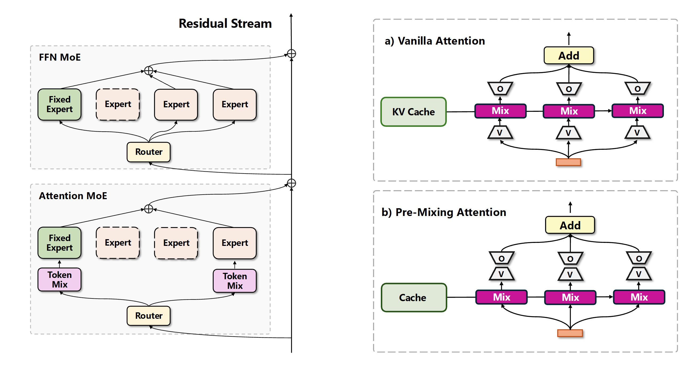

<!-- <div align="center">
  <p>
    
    <span style="font-size: 24px; font-weight: bold; margin-left: 10px;">💥 UMoE w/ Pre-Mixing Attention</span>
  </p>
</div> -->

<div align="center">

# 💥 UMoE w/ Pre-Mixing Attention

</div>

<div align="center">
  
</div>

This repository contains our model implementation (in model_libs/src_code) and training code (train.py).

Paper: [UMoE: Unifying Attention and FFN with Shared Experts](https://arxiv.org/abs/2505.07260)

* [Installation](#installation)
* [Usage](#usage)
* [Training](#training)
* [Variants](#variants)

## Installation
The following requirements should be satisfied:
- pytorch
- triton
- trl
- transformers
- datasets
- wandb
- deepspeed

### Grouped GEMM
To accelerate training, you'll need a Grouped GEMM implementation. Three options are supported:

 - [Grouped Gemm](https://github.com/fanshiqing/grouped_gemm): 
 

    Enable with: ```'use_megatron_cutlass_group_gemm': true``` in the model config.

- [Unsloth](https://github.com/unslothai/unsloth): 

    ```bash
    cd unsloth_moe
    pip install .
    ```

    Enable with: ```'use_unsloth_moe': true``` in the model config.

- [TransformerEngine](https://github.com/NVIDIA/TransformerEngine)

    Enable with: ```'use_te_group_linear': true``` in the model config.

**Note**: You must install [Grouped Gemm](https://github.com/fanshiqing/grouped_gemm), as our current implementation relies on its permute/unpermute operations.

## Usage

We provide model configurations used in our paper. You can easily create these models as follows:

```
from transformers import (
    AutoModelForCausalLM,
    AutoConfig,
)

config = '1B-UMoE-1024'

config = AutoConfig.from_pretrained(os.path.join("model_libs/configs", config), trust_remote_code=True)
model = AutoModelForCausalLM.from_config(config, trust_remote_code=True)
```
Before running the code above, you need to copy the code files from ```model_libs/src_code``` to the specified configs directory. You can also use ``` model_libs/sync_src_code.sh``` to automatically complete this copying process.

## Training

To train the model, simply run the following command in the root directory:

```
config_name=1B-UMoE-1024

deepspeed --master_port 60600 --include=localhost:0,1,2,3 train.py \
        --gradient_accumulation_steps 8 \
        --global_batch_size 1024 \
        --logging_steps 10 \
        --learning_rate 4e-4 \
        --max_steps 50000 \
        --micro_batch_size 32 \
        --world_size 4 \
        --num_proc 10 \
        --save_steps 500 \
        --deepspeed deespeed_zero0_config.json \
        --save_total_limit 2 \
        --dataset_text_field "text" \
        --dataset_100bt \
        --ensure_pad_token \
        --gradient_checkpointing \
        --disable_iter_shuffle \
        --config_name  $config_name \
        --run_name $config_name \
```
The only parameter you need to modify is config_name.

### Dataset

To train on wikitext-103, pass the ```--wikitext_103``` flag to the above command. Otherwise, the model will be trained on fineweb-edu by default.

## Variants

### 1. One head attention for Attention MoE

A limitation of traditional attention is that each head (expert) requires separate token mixing, which restricts scaling activated heads (experts) due to computational constraints.

To address this, we introduce **One Head Attention** for Attention MoE, which feeds identical contextualized token embeddings into experts. This approach delivers performance comparable to FFN-MoE and can serve as a replacement for FFN layers. Enable this feature by setting ```one_head_attention_moe``` to True.

### 2. Universal Transformer

The repository supports sharing a large MoE layer across all layers. You can enable this feature using ```share_layer``` and ```share_layer_repeat_num```. However, our preliminary experiments indicate decreased performance with this approach.
